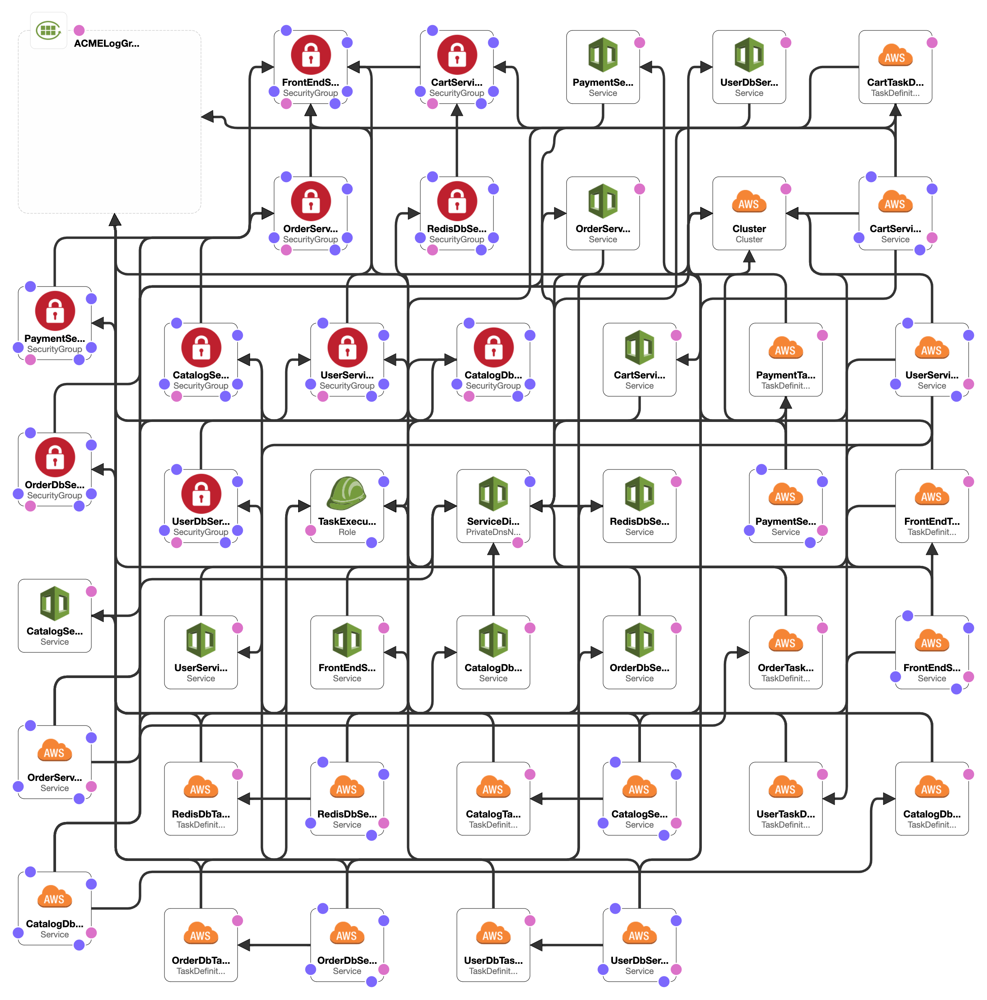

# ACME Fitness Shop on AWS Fargate

***WARNING** You will be billed for the AWS resources used if you create a stack from this template.*

## Pre-requisites

To run this CloudFormation stack, you'll need to have an AWS account. With permission to create:

* Log groups
* ECS Clusters
* Cloud Maps
* Execution Roles
* ECS Task Definitions
* ECS Services
* EC2 Security Groups

## Deploy stack

You can deploy a new CloudFormation stack using

```bash
aws cloudformation create-stack \
--capabilities CAPABILITY_NAMED_IAM \
--stack-name mystack \
--parameters ParameterKey=User,ParameterValue=<your name> \
ParameterKey=Team,ParameterValue=<your team> \
ParameterKey=SourceSecurityGroup,ParameterValue=<your security group> \
ParameterKey=Subnets,ParameterValue=<your subnet> \
ParameterKey=VPC,ParameterValue=<your vpc> \
--template-body file:///<path>/<to>/acme-fitness-shop.yaml
```

## End result

This CloudFormation template will create 44 resources. The _Resource ID_ in the table below is how it is listed in the YAML file. The _Type_ is what is created in your AWS account

| Resource ID                   | Type                                       |
|-------------------------------|--------------------------------------------|
| ACMELogGroup                  | AWS::Logs::LogGroup                        |
| CartService                   | AWS::ECS::Service                          |
| CartServiceDiscovery          | AWS::ServiceDiscovery::Service             |
| CartServiceSecurityGroup      | AWS::EC2::SecurityGroup                    |
| CartTaskDefinition            | AWS::ECS::TaskDefinition                   |
| CatalogDbService              | AWS::ECS::Service                          |
| CatalogDbServiceDiscovery     | AWS::ServiceDiscovery::Service             |
| CatalogDbServiceSecurityGroup | AWS::EC2::SecurityGroup                    |
| CatalogDbTaskDefinition       | AWS::ECS::TaskDefinition                   |
| CatalogService                | AWS::ECS::Service                          |
| CatalogServiceDiscovery       | AWS::ServiceDiscovery::Service             |
| CatalogServiceSecurityGroup   | AWS::EC2::SecurityGroup                    |
| CatalogTaskDefinition         | AWS::ECS::TaskDefinition                   |
| Cluster                       | AWS::ECS::Cluster                          |
| FrontEndService               | AWS::ECS::Service                          |
| FrontEndServiceDiscovery      | AWS::ServiceDiscovery::Service             |
| FrontEndServiceSecurityGroup  | AWS::EC2::SecurityGroup                    |
| FrontEndTaskDefinition        | AWS::ECS::TaskDefinition                   |
| OrderDbService                | AWS::ECS::Service                          |
| OrderDbServiceDiscovery       | AWS::ServiceDiscovery::Service             |
| OrderDbServiceSecurityGroup   | AWS::EC2::SecurityGroup                    |
| OrderDbTaskDefinition         | AWS::ECS::TaskDefinition                   |
| OrderService                  | AWS::ECS::Service                          |
| OrderServiceDiscovery         | AWS::ServiceDiscovery::Service             |
| OrderServiceSecurityGroup     | AWS::EC2::SecurityGroup                    |
| OrderTaskDefinition           | AWS::ECS::TaskDefinition                   |
| PaymentService                | AWS::ECS::Service                          |
| PaymentServiceDiscovery       | AWS::ServiceDiscovery::Service             |
| PaymentServiceSecurityGroup   | AWS::EC2::SecurityGroup                    |
| PaymentTaskDefinition         | AWS::ECS::TaskDefinition                   |
| RedisDbService                | AWS::ECS::Service                          |
| RedisDbServiceDiscovery       | AWS::ServiceDiscovery::Service             |
| RedisDbServiceSecurityGroup   | AWS::EC2::SecurityGroup                    |
| RedisDbTaskDefinition         | AWS::ECS::TaskDefinition                   |
| ServiceDiscovery              | AWS::ServiceDiscovery::PrivateDnsNamespace |
| TaskExecutionRole             | AWS::IAM::Role                             |
| UserDbService                 | AWS::ECS::Service                          |
| UserDbServiceDiscovery        | AWS::ServiceDiscovery::Service             |
| UserDbServiceSecurityGroup    | AWS::EC2::SecurityGroup                    |
| UserDbTaskDefinition          | AWS::ECS::TaskDefinition                   |
| UserService                   | AWS::ECS::Service                          |
| UserServiceDiscovery          | AWS::ServiceDiscovery::Service             |
| UserServiceSecurityGroup      | AWS::EC2::SecurityGroup                    |
| UserTaskDefinition            | AWS::ECS::TaskDefinition                   |



## Delete stack

To delete a stack you've built, run

```bash
aws cloudformation delete-stack \
--stack-name mystack
```

## Monitoring the stack

Optionally, you can use [Wavefront](https://wavefront.com) to monitor your stack. To get started, we've added a sample dashboard (`wavefront.json`). To use this dashboard, first create a new dashboard ans select the **JSON** button on the top right hand side of the screen. In that window, you can copy/paste the contents of `wavefront.json` (just be sure to update the variables _AWS Account ID_ and _ECS Cluster_).


